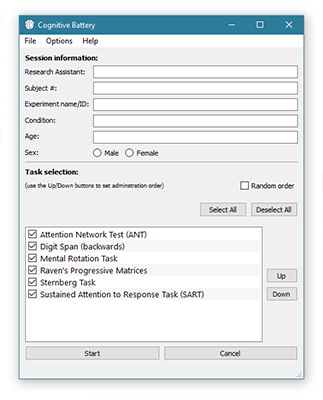
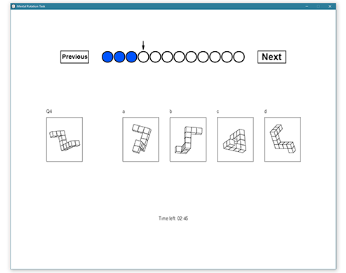

#Cognitive Battery

A Python based battery of common cognitive psychology tasks. Designed to be 
modular as each task is contained within a single Python script/module, the 
results of which are returned as a dataframe for saving.

Pull requests are welcome! Please see the [contribution](#contribution) 
notes below.

 

The battery was originally designed for a resolution of 1280x1024,
but it should work with most resolutions.

Some tasks contain copyrighted images (e.g. Mental Rotations Task, Raven's 
Progressive Matrices) that I cannot include in this repo. In case you have 
access to the original images, I have included an explanation of how to 
name/format those items to work with this battery.

**Note**: I created this project as I needed to get some tasks up and 
running quickly for an experiment. Everything is fully functional as it stands,
but I will be refactoring much of the code over time to clean things up.
This will include things like code reduction, better handling of different
screen resolutions, and improved logic.

##Requirements
You will need to have the following dependencies installed to run the battery,
most of which are just Python modules:

* **Windows 7+**
  - This battery may work on OSX and Linux, but has only been tested on 
  Windows so far.
* **Python 2.7.x**
  - The easiest way to install Python is using the 
  [Anaconda](https://www.continuum.io/downloads) distribution as it also 
  includes most of the other dependencies listed below
  - Python 3 is not currently supported
* **Pandas**
  - Included with Anaconda. Otherwise, install using pip (`pip install pandas`)
* **Numpy**
  - Included with Anaconda. Otherwise, install using pip (`pip install numpy`)
* **PyQT4**
  - Included with Anaconda. Alternatively, full release (including QT designer)
   downloadable from the
   [PyQT4 website](https://www.riverbankcomputing.com/software/pyqt/download)
* **Pygame**
  - Downloadable from the
  [Pygame website](http://www.pygame.org/download.shtml). If you installed
  64bit Python, you will need to download the 64bit Pygame binaries from
  [here](http://www.lfd.uci.edu/~gohlke/pythonlibs/#pygame) and install 
  using pip (`pip install <filename>`)

##Usage
Using the battery is as simple as running the `run_battery.py` file. This 
can either be done using the command line (navigate to the directory and type
`python run_battery.py`), or running it from IDLE.

On the selection screen, all sections are currently mandatory, although some
 may be irrelevant for your particular experiment. You can place arbitrary 
 values in the irrelevant fields.

Select the tasks you want to include by using the checkboxes. The order of 
task administration can be set using the `Up` and `Down` buttons. 
Alternatively, you can set a random order using the checkbox.

The task results are saved in the `/data` directory. Each participant's data
 is saved as an Excel file, where each task is saved to a separate sheet.

##Tasks
Currently implemented tasks:

* **Attention Network Test (ANT)**
  - Based on the original version by
  [Fan et al. (2002)](http://www.mitpressjournals.org/doi/abs/10.1162/089892902317361886#.VlEwI9irSHs)
* **Digit Span (backwards)**
  - Based on the version used by
  [Berman et al. (2008)](http://pss.sagepub.com/content/19/12/1207) and
  [Bourrier (2015)](https://open.library.ubc.ca/cIRcle/collections/ubctheses/24/items/1.0166677)
* **Mental Rotation Task**
  - Based on the redrawn version by
  [Peters et al. (1995)](http://www.ncbi.nlm.nih.gov/pubmed/7546667)
* **Raven's Progressive Matrices**
  - Based on the second set of matrices used in the
  [Wechsler Adult Intelligence Scale](https://en.wikipedia.org/wiki/Wechsler_Adult_Intelligence_Scale#WAIS-IV)
* **Sternberg Task**
  - Based on the original task by [Sternberg (1966)](https://www.ncbi.nlm.nih.gov/pubmed/5939936),
   with trial count and set sizes from [Martins et al. (2012)](http://www.sciencedirect.com/science/article/pii/S1469029212001380)
* **Sustained Attention to Response Task (SART)**
  - Based on the original version by
  [Robertson et al. (1997)](http://www.sciencedirect.com/science/article/pii/S0028393297000158)

##Contribution
**Note**: I intend to majorly streamline this process in future releases, 
hopefully automating the importing/running/saving of tasks.

Each new task you want to add will need to be programmed as a Python module.

Create a class in the module that contains a `run()` method. This method 
should contain the main sequence of your task and needs to return a Pandas 
dataframe object. Your class should also accept a pygame screen and
background object.

An instance of the class is spawned in `run_battery.py`, near the end of the 
`start()` method. Your class's `run()` method is invoked after, and the 
returned dataframe is saved to file.

You'll then need to update the QT Designer UI file 
(`/designer/ui/battery_window_qt.ui`) by adding your task to the list. 
Rebuild using the included `convertUI.bat` script.

**Note**: It is better to modify the UI file using QT Designer and then 
rebuild, rather than directly editing the generated Python file
(`battery_window_qt.py`), because:

- Your changes will be included in the UI file in case anyone wants to use 
QT Designer to make changes later
- Any changes you make will be lost whenever anyone builds from the UI file

In summary:

1. Program a separate `.py` module for your task
2. Include a `run()` method in your class that contains your task sequence 
and returns a Pandas dataframe
3. Import this module in `run_battery.py`
4. Spawn a new instance of your class in `run_battery.py` in the `start()` 
method
5. Invoke your `run()` method and save the returned dataframe to a file
6. Update the QT Designer UI file and rebuild using the conversion script

Consider making a pull request and please include a journal reference for any
new tasks you add.

##TODO
In no particular order...

**General**
- Create an analysis tool for summarizing/aggregating participant data for
the different battery tasks. The goal is to output summary data that is ready
for statistics
- Add option for manually specifying a save data location
- Compile an executable binary version of the entire battery
    - This will make it possible run the battery without dealing with Python
     module installation
- Cross-platform support (OSX and Debian based GNU/Linux)
- **Major** code cleanup across the board

**Tasks**
- Improve support for different screen resolutions
- Streamline the process of adding new tasks
    - Automatically import all task modules
    - Automatically handle task running/saving
    - No longer need to edit the main battery file to add your own tasks
- Add the ability to set options for each task (e.g. number of trials)
- Add description/details for each task (number of trials, timings etc.)
- Save subject data to non-proprietary file format instead of Excel
    - Likely to be CSV, but open to suggestions
- Add more tasks...

##Changelog

###[1.1.0](https://github.com/sho-87/cognitive-battery/releases/tag/1.1.0) *(unreleased)*

**General**
- Moved a number of text, image and background display functions into their own package (`utils`)

**User Interface**
- Created separate class for UI layout and import into main script
- Changed UI base class to `QTMainWindow`
- Created conversion script for building a Python module from UI file
- Added Menu and Status bar to UI
- Added application icons
- Added global Settings window
- Application now stores (and restores) the size and position of windows

**Tasks**
- All tasks (and their images) moved to separate directory
- Improved integration with pygame
- SART timing has been fine tuned to better match the original publication
- Added the Sternberg Task
- Short version of the ANT has been removed

**Bug Fixes**
- Up/Down buttons now correctly disable if random order is selected
- Pygame window now closes if the main battery UI is closed
- CPU time and memory were being used up needlessly in certain tasks. This has been improved
- Error now correctly displays if no tasks have been chosen
- Pygame windows and backgrounds are now passed around the different tasks correctly
- User input is no longer (pre)registered in digit span during digit display

###[1.0.0](https://github.com/sho-87/cognitive-battery/releases/tag/1.0) *(2015-11-21)*
- Initial release